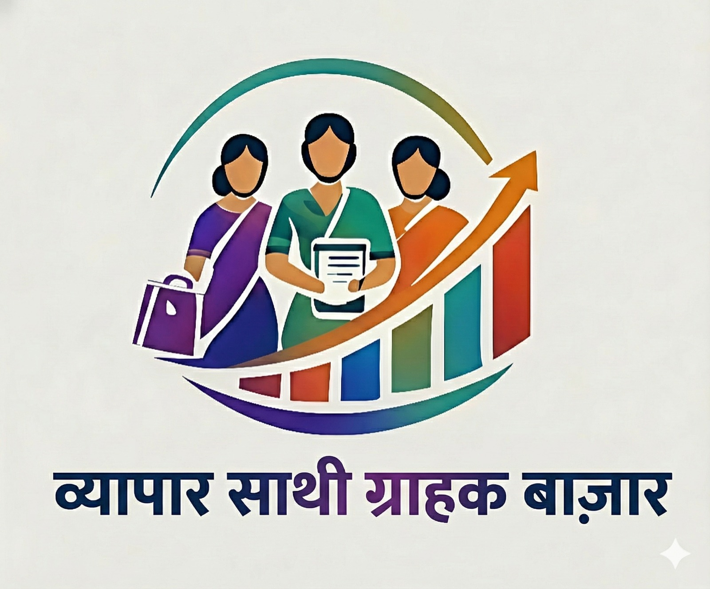

# 🧠 Vyapar Saathi – SHG Digital Commerce Telegram Ecosystem

## 🌍 Empowering SHGs through Digital Innovation

Vyapar Saathi is an AI-powered multilingual Telegram chatbot ecosystem designed to help Self Help Group (SHG) businesses sell products digitally without needing apps, websites, or technical knowledge.

Traditional e-commerce platforms are complex, English-centric, and difficult to use for rural sellers with low digital literacy. Vyapar Saathi solves this by turning simple chat and voice into a complete marketplace experience.

This system allows SHG businesses to register, list products, promote items, and manage orders — all through Telegram in their native language.

---

## 🚨 Problem Statement

Most existing e-commerce and quick-commerce platforms require:

* Website/app usage
* Complex product listing steps
* English language understanding
* Continuous manual interaction

This creates major barriers for:

* Rural SHG sellers
* Low digital literacy users
* Non-English speakers

As a result, many SHGs cannot participate in digital commerce.

---

## 💡 Solution

Vyapar Saathi creates a fully automated marketplace using chatbots where:

* SHG businesses manage their store via Telegram
* Customers browse and order products via chat
* Marketing happens automatically
* Voice interaction supports non-typers
* Multiple Indian languages remove language barriers

---

## 🛠️ Technology Stack

* Python
* Telegram Bot API
* Gemini API (AI-based responses & automation)
* Google Sheets (Database)
* Multilingual NLP support

---

## 🤖 Core Modules

### 1️⃣ Business Chatbot (Seller Bot)

Designed for SHG businesses to manage their digital store.

Features:

* SHG registration
* Add / update products
* Track orders
* Track revenue
* Manage business profile
* Simple menu-driven interaction
* Supports 4 languages:

  * English
  * Hindi
  * Marathi
  * Gujarati

---

### 2️⃣ Customer Chatbot (Marketplace Bot)

Acts like a chat-based e-commerce platform.

Features:

* Browse products from multiple SHGs
* View product details
* Place orders instantly
* No waiting for seller replies
* Simple selection-based UI
* Local language support

---

### 3️⃣ Marketing Chatbot

Automates promotion for SHGs.

For Businesses:

* Select product to promote
* AI generates promotional messages
* Sends offers to all customers automatically

For Customers:

* Receive offers
* Product updates
* Discount alerts

---

### 4️⃣ Voice Sarthi 🎙️

Special feature for digitally less-literate SHG sellers.

Features:

* Voice-based interaction
* Sellers can speak instead of typing
* Bot responds using voice guidance
* Helps with:

  * Product addition
  * Navigation
  * Instructions
  * Queries

This makes the system accessible to users unfamiliar with typing or smartphones.

---

## 📊 Impact

* Enables rural SHGs to sell digitally
* Removes language barriers
* Reduces dependency on middlemen
* No need for apps or websites
* Voice support for low digital literacy users
* Promotes local products and entrepreneurship

---

## ⚙️ Setup Instructions

1. Configure credentials

   Wherever required in the code:

   * Create your own Telegram Bot Token using BotFather
   * Generate your own Gemini API Key
   * Create your own Google Sheet and use its Sheet ID

   Replace the placeholder values in the code with your respective:

   * TELEGRAM_BOT_TOKEN
   * GEMINI_API_KEY
   * GOOGLE_SHEET_ID

2. Branding setup

   * Replace the existing logo image files with your respective logo images as needed.

3. Run the bot

   * Run all the bot Scripts together

---

## 🎯 Target Users

* Self Help Groups (SHGs)
* Rural entrepreneurs
* Small-scale home businesses
* Local product sellers

---

## 🏁 Project Type

Hackathon / Social Impact Innovation Project focused on rural digital empowerment.

---

## 🏆 Project Achievement

Developed as a part of the hackathon **Impactathon** and awarded **1st Prize**.
The project was recognized and certified by **Dr. Preeti Adani, Chairperson – Adani Foundation**.

---

## 👨‍💻 Developed By

* Swanand Wirkar @Swanand-24
* Nikhil Fuke https://github.com/nikhilfuke1
* Jahanvi Mishra https://github.com/JahanviM82
* Shalini Singh https://github.com/shalinisingh26
* Jyot Buch
